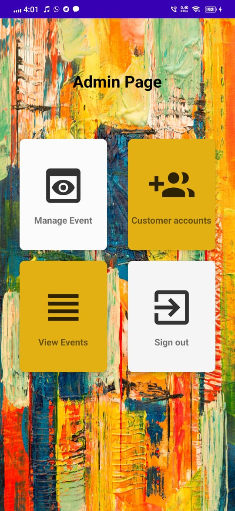

# EvenTo_app_firebase
...............................Étudiant...................................
EvenTo is an event management mobile application which allow the both sides of users to manage the events. 
The app designed for the admin side (can be the organization who own the system) and the customer side(can be the normal user of the service) as well.
The app designed with many features to achieve good GUI and functionality. Furthermore, the app designed using Java language and Firebase cloud service. 

App features: 
1. The app implemented with Firebase cloud service.
2. The app can run on any android devices with 5.0v OS and above.
3. The app implemented with authentication.
4. The app designed for to type of users.

Firebase service used: 
  1. authentication: to create the admin account
  2. database: to store the accounts and events details
  3. storage: to upload event images

App funcationality:
1. Login Page for both users and admin    
2.  Sign up   
    

3. <b>Admin user: </b>  
   a. admin dashboard  
    
   
   b. Manage event  
     
    
    
   c. Customer accounts  
     
    
    
   d. View all events  
    

3. <b>Customer user:</b>  
   a. Customer Dahsboard  
     
    
    
   b. Add Event  
     
    
    
   c. View my Events  
     
    
    
   d. Event Dahsboard  
     
    
   
    
    
    
App limitations: 
 1. The app missing some features such as update, delete, search..
 2. The app GUI needs to be imporved 
 
 
App future enhancements:
  1. add all the missing features
  2. improve the authentation
  3. improve the GUI
  4. add recoomendation engine
  5. add offline mode 
  
  
 To conclude with, this application is a good example for starters in Java android studio. 
 The application with more work on it and new idea can be considered as real application to handle the business tasks. Please
 contact me for any question or feedback using the following contacts. 
 
 Email: anandsinghtechie@gmail.com  
 Github: Anand-Singh-techie
    
    
    
    
